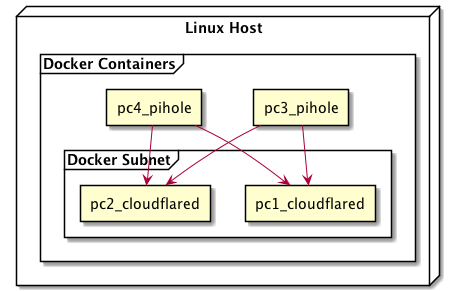

# Set-up Pi-Hole

The Repository contains a set-up of two Pi-hole container instances with docker.

**Disclaimer:** *These scripts and procedures are without any warranty. 
There is a risk of losing internet access, and the internet router has to reset to the default entries to the internet provider.*

## Pi-Hole

The [Pi-hole®](https://docs.pi-hole.net) project is a DNS sinkhole that protects your devices from unwanted content without installing any client-side software.

The project can use as an ad blocker for each device on a network. It can also block particular domains for internet access (e.g., known malware, spyware, ransomware,  youth protection, Etc.). 
 
## DNS Providers

The Domain Name System (DNS) finds the internet address of a domain name. Pi-Hole can use as a Domain Name System. The users can switch between a bunch of DNS providers. It is also possible to set up to own clients to DNS providers. Some DNS providers use the DNS for their own business, e.g., Google.

This project use [Cloudflare](https://www.cloudflare.com/learning/dns/what-is-dns) as DNS Provider.

## Set-up Environment

The set-up of the docker compose stack is describe [here](set-up-stack.md).

The deployment diagram describes the setup of the four docker containers.



## Upgrade Pi-Hole

To upgrade the stack to the next Pi-Hole Version is easy. It runs in three steps:
1. **pull** loads the newest version of the Pi-Hole container from the Docker Hub.
1. **down** stops the hole stack and removes all containers and networks defined in the [docker-compose.yml](scripts/docker-compose.yml). 
1. **up** build the containers and networks and starts all four docker containers.

The upgrade can be do with the script [upgrade-stack.sh](scripts/upgrade-stack.sh).

```
docker-compose -p pihole pull
docker-compose -p pihole down
docker-compose -p pihole up -d
```

## Conclusion
- After more than a year of using it, we got less internet advertising, and many internet sides run fast without problems.
- Old internet devices have higher protection against spy and ransomware.
- Some commercial sites and payments services must be unlocked. For users with a high affinity to computer systems, it is no big deal. Ordinary computer users can run into problems.
- The project covers the best practices from more than a year productive environment. 
- Updates with docker-compose are easy and down under five minutes with one script.
- If the internet router is bind to the two pi-hole instances, internet access can be lost. In this case, the internet router must set to the default DNS providers from the Internet Provider.
